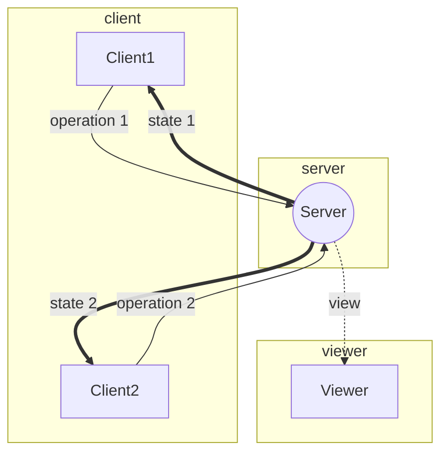
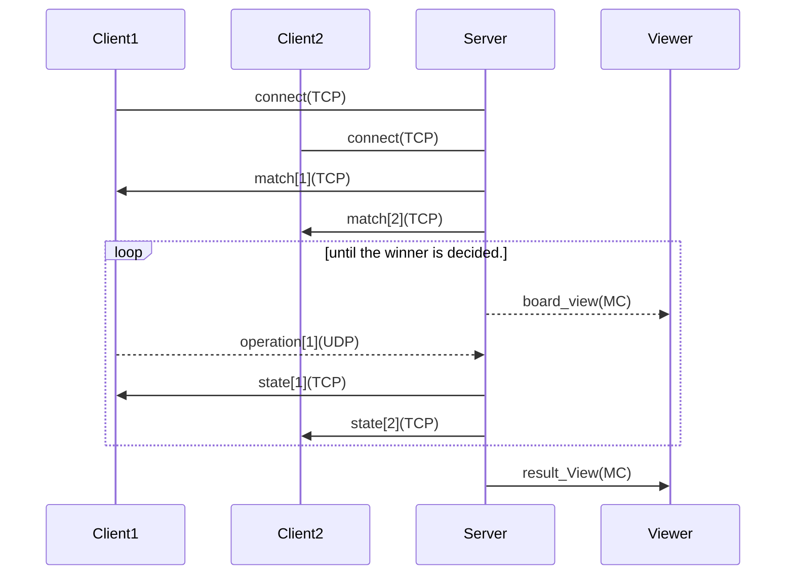

# 要件

## 必須要件

### 全体

- サーバーを介して、２つのクライアントで鬼ごっこができる
- 「ゲームサーバー」、「ゲームクライアント」、「表示プログラム」の３つを作成する
- 「ゲームサーバー」と「ゲームクライアント」間の通信は TCP または UDP を用いて行われる

### ゲームサーバー

- フィールドの状況はマルチキャストで任意のアドレスに送信する
- キャラクターの位置の管理などを行う
- フィールドの大きさは 10×10 以上である
- 駒は上下左右に移動が可能である
  - 駒 ID と 2,4,6,8 のコマンドを受信し(x,y)座標を変更する
- 駒の位置が重なったらゲーム終了である

### ゲームクライアント

- ゲームクライアントは移動コマンドの送信を行う

### 表示プログラム

- フィールドの状況をマルチキャストでサーバーから受信し表示する

## 追加要件

### ゲームサーバー

- 時間制限機能を実装する
- フィールドに障害物を事前に配置しゲーム性を高める

### ゲームクライアント

- フィールドに障害物を表示させる
- サーバーから時間情報を受け取り、残り時間を表示する

### 表示プログラム

- 障害物を表示できるようにする
- 時間情報を受け取り、残り時間を表示する

# 外部設計

## UI

### ゲームサーバー

**サーバーの起動**

```
tags <port>
```

**ログ:実行時のログ**
接続時

```
LOGIN : <userIP:userPort>
```

**ログ:ゲームが開始した時**

```
START
```

**ログ:ユーザーが勝利した時**

```
WIN : <userIP:userPort>
```

**ログ:ユーザーが敗北した時**

```
LOSE : <userIP:userPort>
```

**ログ:ゲームが終了した時**

```
FINISH
```

**例**

```
LOGIN 1
LOGIN 2 1
START
WIN 1
LOSE 2
FINISH 1
```

## ゲームクライアント

**ゲーム接続中の画面**

```
=========================
PLEASE WAIT A FEW MOMENTS
=========================
```

**勝利画面**

```
===================
  YOU ARE WINNER!
===================
-------------------
continue : c
quit : q
-------------------
```

**敗者画面**

```
===================
  YOU ARE LOSER!
===================
-------------------
continue : c
quit : q
-------------------
```

### 表示プログラム

**ゲーム中**

```
TIME:999s
+-+-+-+-+-+-+-+-+-+-+
|*| | | | | | | | | |
+-+-+-+-+-+-+-+-+-+-+
| | | | | | | | | | |
+-+-+-+-+-+-+-+-+-+-+
| | | | | | | | | | |
+-+-+-+-+-+-+-+-+-+-+
| | | | | | | | | | |
+-+-+-+-+-+-+-+-+-+-+
| | | | | | | | | | |
+-+-+-+-+-+-+-+-+-+-+
| | | | | | | | | |o|
+-+-+-+-+-+-+-+-+-+-+
```

- \*は鬼
- o 逃走者

**ゲーム終了後**

```
WINER is <userIP:userPort>!
LOSER is <userIP:userPort>!
```

- 勝者と敗者を表示する。

## ゲーム時の通信フロー



# 詳細設計

## 通信内容



<br>

### 通信のフォーマット

### ゲームの開始を通知する(Server->Client)-TCP

**match**

```
M <port> <pieces> <is_hunter>
```

- port は UDP サーバーのポート番号
- pieces はプレイヤーに割り当てられた駒の番号
  - これと操作内容をメッセージで送ることで駒を操作する
- is_hunter は鬼かどうかを表す(0 or 1)

### ゲームの状態を送信する(Server->Client)-TCP

**state**

```
S <state>
```

- state=0:まだ勝負はついていない
- state=1:敗北
- state=2:勝利

### 操作内容を送信する(Client->Server)-UDP

**operation**

```
O <target> <command>
```

- target は鬼か、逃走者か
- command は 2,4,6,8 の数字のどれか

### ゲームのビューを送信する(Server->Viewer)-MultiCast

**board_view**

```
TIME <time(sec)>
<boad>
```

**result_view**

```
WINER <userIP:userPort>
LOSER <userIP:userPort>
```

これらは送信されてきた文字列をただ表示するだけ。
